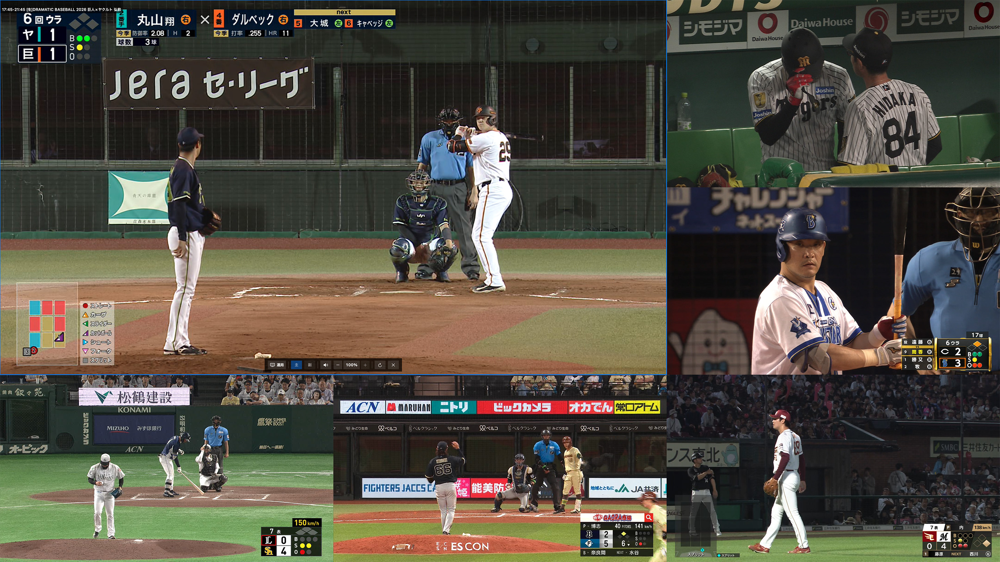
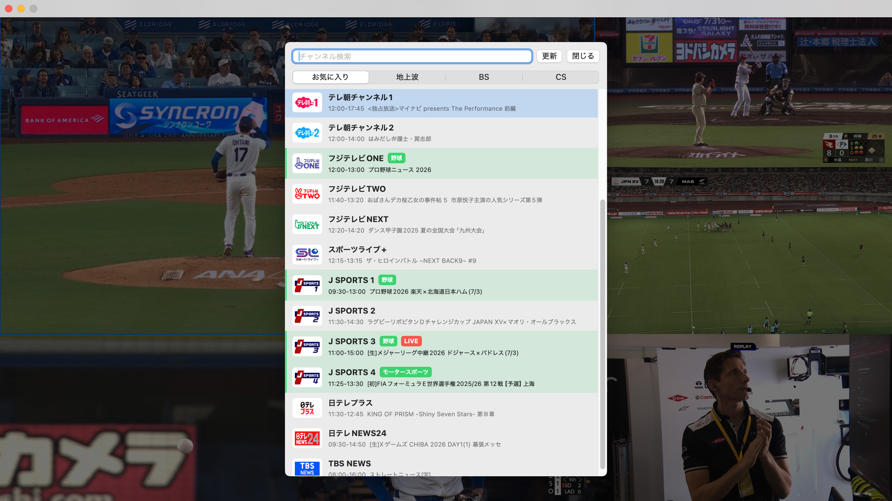
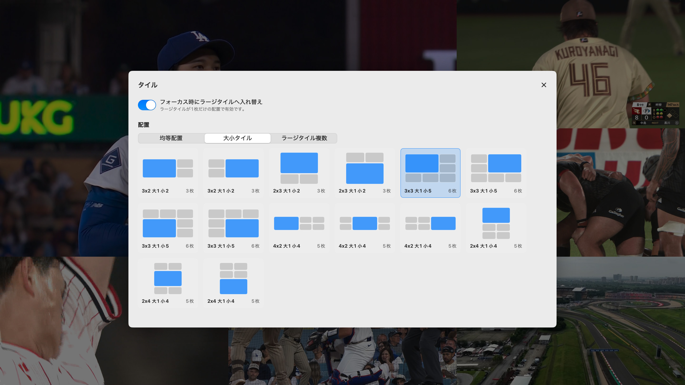

# ReplayCenter

ReplayCenter は、EPGStation のライブ TV ストリームを macOS 上でタイル表示する視聴アプリです。

例えばプロ野球中継の全試合など、複数チャンネルを同時に眺めながら、注目するタイルだけを大きくしたり、音声を切り替えながら視聴する用途を想定しています。



## 主な機能

- EPGStation ライブストリーミングのチャンネルを選局して視聴
- 複数のチャンネルをタイル状に並べて同時視聴
- 1枚表示から最大9枚表示までのタイル配置切り替え
- 横長、縦長、均等配置、2倍サイズのラージタイルを含む大小タイル配置
- タイルのドラッグ入れ替え
- フォーカスしたタイルだけ音声を再生
- タイルごとの音量調整
- デュアルモノラル、2 ストリーム音声の主/副切り替え
- 放送波のイベントリレー情報に基づくリレー先チャンネルへの自動追従
- ラージタイル / スモールタイル別の EPGStation トランスコード設定またはインタレ解除設定
- お気に入り・非表示チャンネル管理、チャンネルロゴ表示
- 番組ジャンルによる強調表示 / 弱表示

## 名前の由来

ReplayCenter という名前は、NPB のリプレー検証設備である「[リプレーセンター](https://www.nikkansports.com/baseball/news/202603240000436.html)」に由来します。リプレーセンターの「モニターを6枚並べて試合映像を見ている」写真に着想を受けたもので、名前に反して巻き戻し機能があったりするわけではありません。

## 動作環境

- macOS 15 Sequoia 以降（Intel / Apple Silicon 両対応）
- EPGStation

ReplayCenter は Mirakurun を直接操作するのではなく、EPGStation API を利用しています。
初回起動時に EPGStation URL を設定すると、以後の設定はアプリ側に保存されます。

## インストール

1. [GitHub Releases](https://github.com/b00t0x/ReplayCenter/releases) から
   `ReplayCenter-<version>-universal.dmg` をダウンロードします。
2. dmg を開き、`ReplayCenter.app` を `Applications` にドラッグします。
3. `ReplayCenter.app` を起動します。

現在の配布ビルドは Apple の公証を取得していません。
macOS にブロックされた場合は、システム設定の「プライバシーとセキュリティ」から許可して開いてください。

コマンドで quarantine を外す場合は、内容を理解した上で次を実行します。

```bash
xattr -dr com.apple.quarantine /Applications/ReplayCenter.app
```

## 初期設定

初回起動時、または EPGStation URL に接続できない場合は、設定画面が自動で開きます。

1. EPGStation URL を入力します。
   例: `http://epgstation.local:8888`
2. 保存します。
3. API への疎通チェックに成功すると、設定画面を閉じられるようになります。

macOS のローカルネットワーク許可ダイアログが出た場合は許可してください。
許可直後にチャンネル一覧が空に見える場合は、選局画面の更新ボタンを押すか、アプリを再起動してください。

## 基本操作



- タイルをクリック: フォーカス
- タイルをダブルクリック: 選局
- `C`: フォーカスタイルで選局
- `T`: タイル配置を変更
- `Delete`: フォーカスタイルを閉じる
- `M`: ミュート切り替え
- `[` / `]`: 音量を 5% 刻みで下げる / 上げる
- `Esc`: フルスクリーン解除
- タイルをドラッグ: 他タイルと入れ替え。1枚表示ではウィンドウ移動

マウスをウィンドウ上に置くと、操作パネルやタイトルバーが表示されます。
しばらく操作しないと、パネルとカーソルは自動的に隠れます。

## タイル配置



`T` キーでタイル配置選択画面を開き、表示したいレイアウトを選ぶとすぐに反映されます。
均等配置だけでなく、1枚を大きくした配置や、横長・縦長の配置も選べます。

ラージタイルが1枚のレイアウトでは、フォーカスしたタイルをラージタイルへ自動的に入れ替える設定も使えます。

## 設定

設定画面では、主に次を変更できます。

- EPGStation URL
- チャンネル管理
- ラージタイル / スモールタイル別の再生設定
- 音量初期値
- チャンネル情報やストリーム情報の表示
- リレー中継の自動追従
- 強調表示 / 弱表示する番組ジャンル

## 注意事項

- 録画番組再生や録画予約など、EPGStation の録画に関する操作は対象外です。
- 4K 放送は選局対象外です。
- 字幕 / データ放送の表示には対応していません。
- 配布ビルドは ad-hoc 署名で、Apple の公証は取得していません。
- EPGStation 側のライブストリーミング設定やトランスコード設定により、画質、遅延、負荷は変わります。
- トランスコードありではサーバー側にエンコード負荷、トランスコードなしではクライアント側にインタレ解除負荷がかかります。
- 同時視聴できるタイル数は、EPGStation サーバーと Mac の性能、ネットワーク、再生設定に依存します。
- リレー中継の自動追従は、放送局が ARIB のイベントリレー情報を送出する番組だけで機能します。

## クレジット

ReplayCenter は次のライブラリ / ソースコードを利用しています。

- [SwiftVLC](https://github.com/harflabs/SwiftVLC): libVLC を Swift から利用するために使用（[MIT License](https://github.com/harflabs/SwiftVLC/blob/main/LICENSE)）。
- [libVLC](https://www.videolan.org/vlc/libvlc.html) : SwiftVLC 経由で利用し、配布ビルドに含まれます。libVLC は LGPLv2.1 で公開されています。ReplayCenter のソースコードとビルド手順はこのリポジトリで公開しており、配布ビルドは同じ手順で再ビルドできます。ライセンスについては [VideoLAN legal](https://www.videolan.org/legal.html) および [COPYING.LIB](https://github.com/videolan/vlc/blob/master/COPYING.LIB) を参照してください。
- [tsreadex](https://github.com/xtne6f/tsreadex): AAC / TS 処理の一部ソースコードを利用（[MIT License](https://github.com/xtne6f/tsreadex/blob/master/License.txt)）。利用しているソースの詳細は [third_party/notes.md](Sources/ReplayCenterStreamFilter/third_party/notes.md) を参照してください。

## 開発者向け情報

ビルド、dmg 作成、GitHub Actions、デバッグ設定、stream filter の詳細は
[DEVELOPMENT.md](DEVELOPMENT.md) を参照してください。
